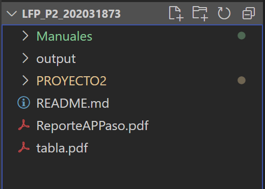
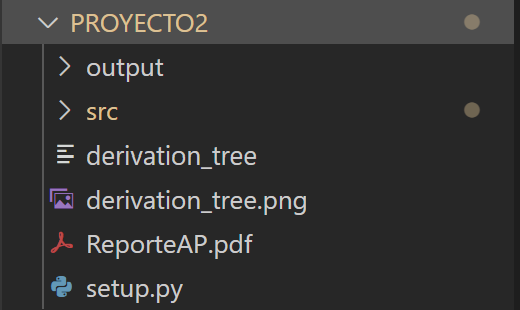
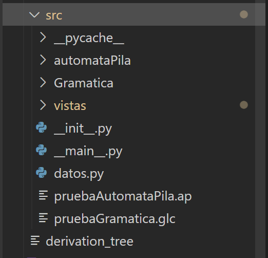
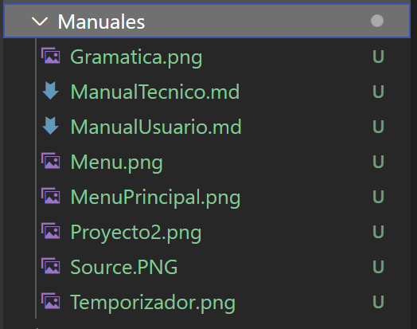
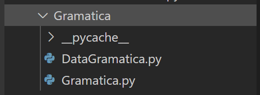
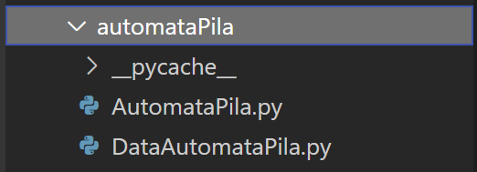
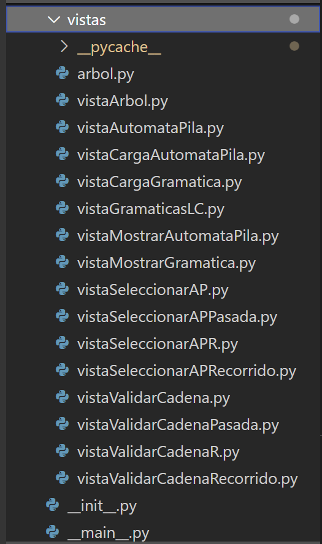

# **Manual Tecnico**  

## Ana Massielle Coti Rodas  
## 202031873  

### Lenguajes Formales y de Programacion  

#### Vaquera Junio 2023  
#### Seccion "P"  

# Índice
## Introduccion
## Objetivos
## Uso y Operacion
## Solucion de Problemas
## Preguntas Frecuentes
## Referencias y recursos adicionales

#### Introducción:
Este manual está diseñado para proporcionar a los usuarios y técnicos una guía exhaustiva y detallada sobre el funcionamiento, instalación, configuración, mantenimiento y solución de problemas de un sistema o dispositivo tecnológico específico. Está destinado a ayudarte a comprender y aprovechar al máximo todas las características y capacidades del producto, garantizando un uso eficiente y confiable.

#### Objetivos: 
* Utilizar la herramienta de Graphviz para la creación y visualización de gramaticas y automatas de pila dentro del software desarrollado.
* Aprender y utilizar la biblioteca de Markdown para generar documentación clara y legible dentro del software.
* Familiarizarse con la biblioteca de Tkinter para el desarrollo de interfaces gráficas de usuario (GUI) interactivas en Python.
* Integrar la funcionalidad de Tkinter en el software para proporcionar una experiencia de usuario intuitiva y amigable.

#### Uso y operación:

  
   
   
   
  
    

#### Solución de problemas:
* Identificar el problema:
Observa y describe detalladamente el problema que estás experimentando. Define los síntomas, mensajes de error o comportamientos inesperados que estás observando.
Determina si el problema es constante o intermitente, y si está relacionado con una función o acción específica del sistema.

* Verificar conexiones y alimentación:
Asegúrate de que todos los cables y conexiones estén correctamente enchufados y asegurados.
Verifica que el sistema o dispositivo esté correctamente conectado a la fuente de alimentación y que haya suficiente energía disponible.

* Reiniciar el sistema:
Intenta reiniciar el sistema o dispositivo afectado. Apaga el dispositivo, desconéctalo de la fuente de alimentación y espera unos segundos antes de volver a encenderlo.

* Consultar la documentación:
Revisa el manual del usuario y la documentación técnica proporcionada. Busca secciones específicas relacionadas con el problema que estás enfrentando para obtener orientación adicional.

* Actualizar el software:
Verifica si hay actualizaciones de software disponibles para el sistema o dispositivo. Visita el sitio web del fabricante o utiliza las herramientas de actualización proporcionadas para obtener la versión más reciente.

* Realizar pruebas de diagnóstico:
Utiliza las herramientas de diagnóstico o pruebas incorporadas en el sistema o dispositivo para identificar problemas específicos.
Realiza pruebas de rendimiento, pruebas de conexión, pruebas de hardware, etc., según corresponda.

* Comprobar compatibilidad y requisitos:
Verifica si el sistema o dispositivo es compatible con los requisitos mínimos del hardware y software necesarios para su funcionamiento adecuado.
Asegúrate de que todos los componentes y software relacionados cumplan con los requisitos recomendados.

#### Preguntas frecuentes:
**¿Que es una Gramatica Regular?**

Una gramática regular es un tipo de gramática formal que define un lenguaje regular. Los lenguajes regulares son un subconjunto de los lenguajes formales y son reconocidos por autómatas finitos, como los autómatas de estado finito (AFD) o los autómatas de pila vacía (APV).

Una gramática regular está compuesta por un conjunto finito de símbolos terminales, un conjunto finito de símbolos no terminales, un símbolo inicial y un conjunto finito de reglas de producción. Las reglas de producción tienen la forma A -> αB o A -> α, donde A y B son símbolos no terminales, α es una cadena de símbolos terminales y no terminales, y -> indica la transformación o reescritura.

**¿Que es un Automata de Pila?**

Un autómata de pila, también conocido como autómata con pila o pushdown automaton en inglés, es un modelo matemático utilizado en ciencias de la computación y teoría de lenguajes formales. Es una extensión del autómata finito que utiliza una pila (una estructura de datos tipo LIFO) como memoria adicional para almacenar información durante la computación.

**¿Cuál es la diferencia entre una gramática regular y una gramática libre de contexto?**

Las gramáticas regulares tienen reglas de producción más restrictivas que las gramáticas libres de contexto. Las gramáticas regulares solo permiten producciones de la forma A -> ε, A -> aB y A -> a, donde A y B son símbolos no terminales y a es un símbolo terminal. Las gramáticas libres de contexto permiten producciones más generales, como A -> α, donde α puede ser cualquier cadena de símbolos terminales y no terminales.

**¿Cuándo se utilizan las gramáticas regulares?**

Las gramáticas regulares se utilizan para describir lenguajes regulares, que son lenguajes formales con estructura regular. Estos lenguajes son útiles en el análisis léxico de compiladores, reconocimiento de patrones y procesamiento de cadenas simples, como expresiones aritméticas o de números.

**¿Cuál es la relación entre las gramáticas regulares y los autómatas de pila?**

Existe una correspondencia directa entre las gramáticas regulares y los autómatas de pila. Dada una gramática regular, se puede construir un autómata de pila equivalente que reconoce el mismo lenguaje. Del mismo modo, dado un autómata de pila, se puede construir una gramática regular equivalente que genera el mismo lenguaje.

**¿Cuándo se utilizan los autómatas de pila?**

Los autómatas de pila se utilizan en el análisis sintáctico de lenguajes de programación, la construcción de analizadores sintácticos y la verificación de propiedades en sistemas formales. Son útiles para reconocer lenguajes libres de contexto y analizar la estructura jerárquica de las construcciones sintácticas.

#### Referencias y recursos adicionales:
* Documentación de Python:
Sitio web oficial de Python: https://www.python.org/doc/
Documentación de Python: https://docs.python.org/
Tutorial de Python: https://docs.python.org/tutorial/index.html
Documentación de Tkinter:

* Documentación oficial de Tkinter: https://docs.python.org/3/library/tkinter.html
Tkinter — Python Course: https://www.python-course.eu/tkinter/
Python GUI Programming with Tkinter - Real Python: https://realpython.com/tkinter-python-gui-tutorial/

* Documentación de Graphviz:
Sitio web oficial de Graphviz: https://graphviz.org/
Documentación de Graphviz en Python: https://graphviz.readthedocs.io/
Graphviz - Python Package Index (PyPI): https://pypi.org/project/graphviz/

* Documentación de Markdown:
Especificación de Markdown: https://daringfireball.net/projects/markdown/syntax
Markdown Guide: https://www.markdownguide.org/
Tutorial de Markdown: https://www.markdowntutorial.com/

* Documentación de ReportLab:
Sitio web oficial de ReportLab: https://www.reportlab.com/
Documentación de ReportLab: https://www.reportlab.com/docs/reportlab-userguide.pdf
Tutorial de ReportLab: https://www.reportlab.com/docs/reportlab-userguide.pdf