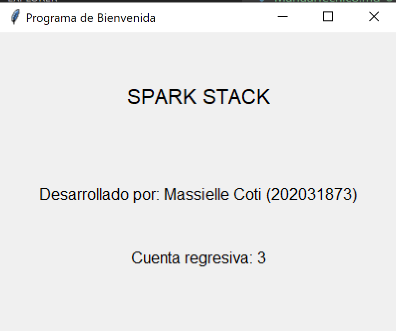
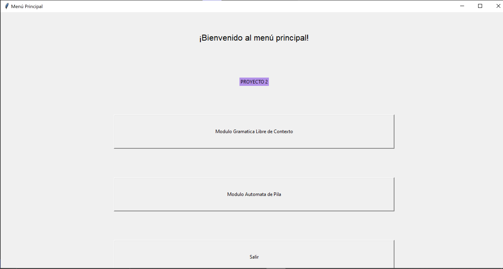
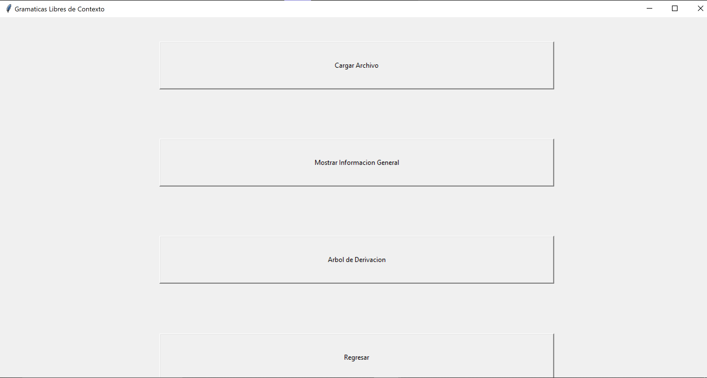

# **Manual de Usuario**  

## Ana Massielle Coti Rodas  
## 202031873  

### Lenguajes Formales y de Programacion  

#### Vaquera Junio 2023  
#### Seccion "P"  

##### Introducción:  
Este manual está diseñado para proporcionar una guía completa sobre el funcionamiento y la operación de los autómatas de pila y las gramaticas regulares. Un autómata es una máquina que sigue una serie de instrucciones predefinidas para realizar tareas específicas. Estas máquinas se utilizan en una amplia gama de industrias y sectores, desde la fabricación y la automatización industrial hasta la inteligencia artificial y la robótica.

#### Instrucciones de seguridad:
* Lea y comprenda completamente el manual del usuario: Antes de operar un autómata o gramatica, asegúrese de leer detenidamente el manual del usuario proporcionado por el fabricante. Familiarícese con las instrucciones de seguridad específicas y las precauciones recomendadas para su modelo de autómata en particular.

* Capacitación adecuada: Asegúrese de recibir la capacitación adecuada sobre el funcionamiento y manejo de los autómatas y gramaticas. Comprenda los conceptos básicos de la programación y la operación de los autómatas antes de comenzar a utilizarlos.

* Reporte cualquier problema o mal funcionamiento: Si observa algún problema o mal funcionamiento en el autómata, informe de inmediato al personal responsable o al soporte técnico. No intente reparar o modificar el autómata por su cuenta, a menos que esté debidamente capacitado y autorizado para hacerlo.

#### Requisitos del sistema:

* Python 3.11.4 (del 6 de junio de 2023)
* 8 o 16 GB de RAM
* PyInstaller 4.5.1 (Jun 8, 2023)

#### Instrucciones de uso:

  
    
    
    
    

#### Glosario de términos:

* Lenguaje Formal: Es un conjunto de cadenas o secuencias de símbolos que siguen ciertas reglas gramaticales y semánticas. Los autómatas se utilizan para reconocer y generar lenguajes formales.

* Transición: En un autómata, una transición representa el cambio de un estado a otro en respuesta a una entrada específica. Cada estado puede tener múltiples transiciones asociadas, lo que define el comportamiento del autómata.

* Estado: Es una condición o configuración en la que se encuentra un autómata en un momento dado. El estado puede cambiar en respuesta a las entradas recibidas y determina las acciones o transiciones futuras del autómata.

* Alfabeto: Es un conjunto finito de símbolos utilizados en un autómata. Estos símbolos pueden ser letras, números u otros caracteres que el autómata puede reconocer y procesar.

* Función de Transición: Es una función que define las posibles transiciones de un autómata de un estado a otro en respuesta a una entrada específica. La función de transición mapea un estado actual, un símbolo de entrada y un estado siguiente.

* Gramática Regular: Es una gramática formal que describe un lenguaje regular. Los autómatas finitos son capaces de reconocer lenguajes regulares, lo que los convierte en herramientas poderosas para trabajar con gramáticas regulares.

* Expresión Regular: Es una secuencia de caracteres que define un patrón de búsqueda. Las expresiones regulares se utilizan para realizar búsquedas y manipulaciones de texto basadas en patrones, y pueden ser implementadas en autómatas finitos.
